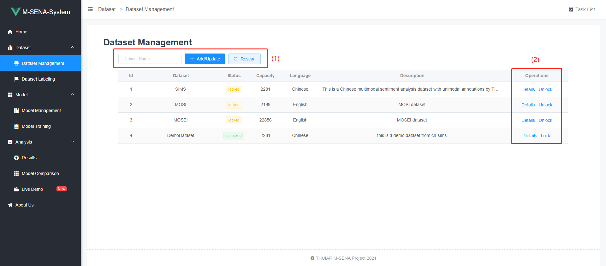
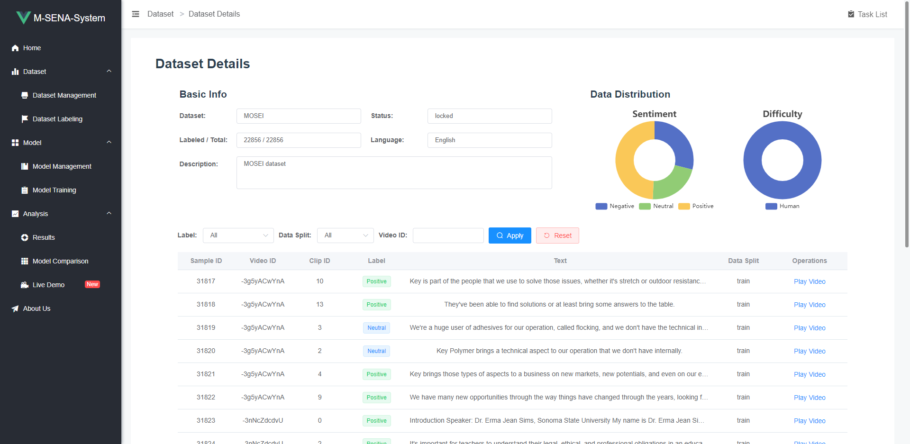
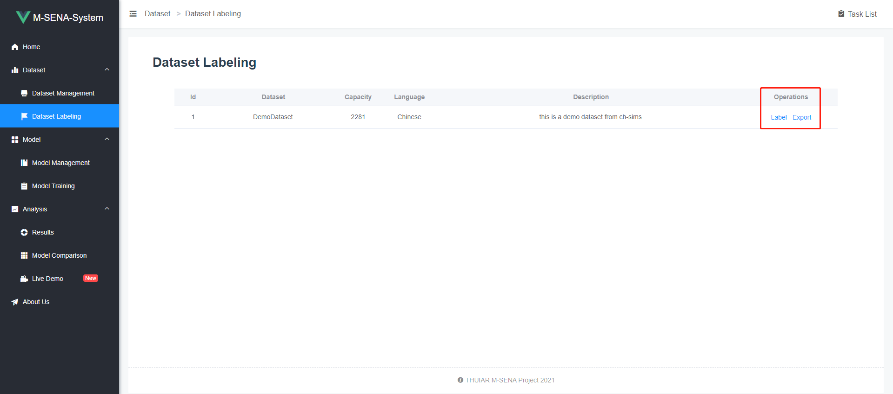
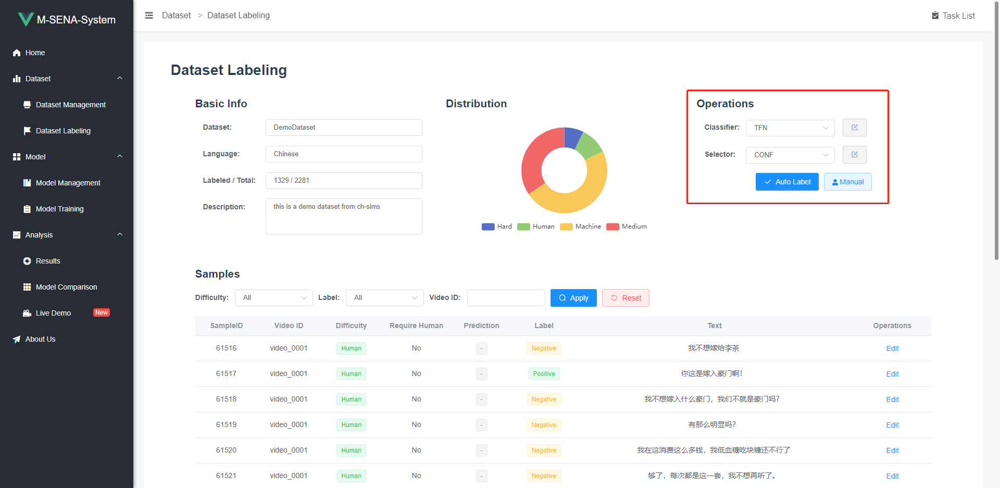
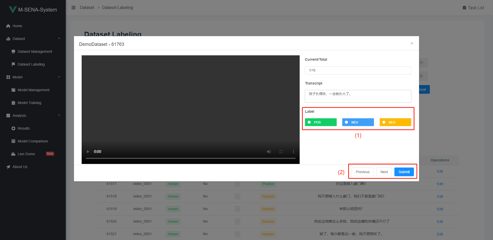
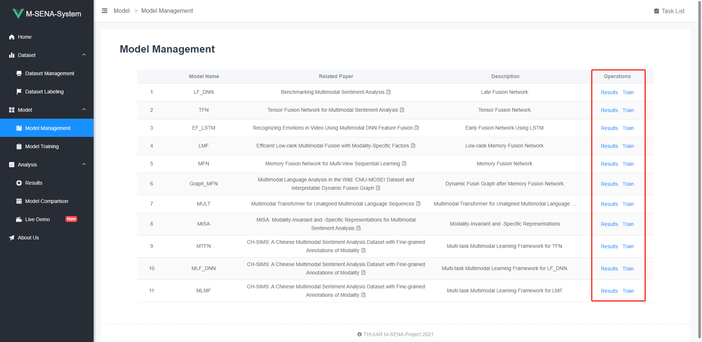
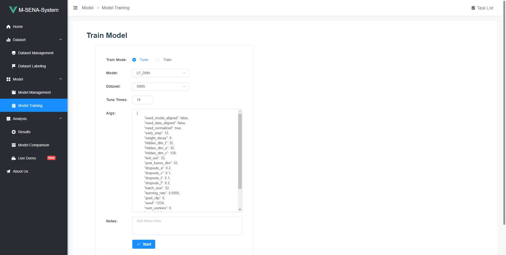

M-SENA Platform Frontend

- [Installation](#Installation)
- [Usage](#Usage)
  - [Dataset](#Dataset)
    - [Dataset Management](#Dataset-Management)
    - [Dataset Details](#Dataset-Details)
    - [Dataset Labeling](#Dataset-Labeling)
  - [Model](#Model)
    - [Model Management](#Model-Management)
    - [Model Training](#Model-Training)
  - [Analysis](#Installation)
    - [Results](#Results)
  - [Task List](#Task-List)

# Installation

# Usage

## Dataset

### Dataset Management

This page lists all the datasets available in the database along with some brief introduction.



1. Add/Rescan Dataset

The "Add/Update" button adds/updates a single dataset according to the given dataset name to the left. The "Rescan" button delete all existing datasets and re-add them along with new datasets. For detailed instructions on formatting and placing datasets, please refer to the [backend readme]()

> Note: After updating one or more datasets, detailed sample data of previously trained results will be lost.

2. Operations for datasets

The "Details" button leads to a ["Dataset Details"]() page where more detailed information of the dataset will be given.

The "Lock/Unlock" button locks/unlocks the dataset. Locked datasets will not show up in the ["Dataset Labeing"]() page.

### Dataset Details

More information is given in this page, including data distribution charts, sample lists with filters and video players for each sample.



### Dataset Labeling

All the unlocked datsets are listed here. The "Label" button leads to a new page where all the labeling configurations and operations are given. The "Export" button exports all samples with their labels in the format of csv files.



After clicking the "Label" button, the new page looks like this:



The operation panel is on the top right corner. The classifier and selector used in auto labeling is selected and configured here. For more details about the auto labeling algorithm, please read [our paper]().

The labeling process should be a loop like this: "Manual --> Auto --> Manual", till all samples are labeled. When labeling a new dataset, a few labels should be manually given first. After each round of auto labeling, a few samples requiring manual correction will be sorted out by the algorithm.

After clicking the "Auto Label" button, the labeling task will start in background. The task is listed in the ["Task Lisk"]().

After clicking the "Manual" button, the page will look like this:



1. Click on the labels to add manual label to the given sample.

2. Use these buttons to navigate through the given sample list. Clikc "Submit" button to save all labels. You don't have to label all the samples in the list. However, the more samples you label, the higher the accuracy will be for the next round of auto labeling.

## Model

### Model Management

This page lists all the models available in the system. Feel free to add new models.



The "Results" button leads to ["Results"]() page where trained results of the model is ilsted. The "Train" button leads to ["Model Training"]() page where you can train the model with specific parameters.

### Model Training

You can modify model parameters and start training tasks on this page.



The "Train Mode" has two options, "Tune" and "Train". The "Tune Mode" allows you to try different sets of parameter combinations. To do this, simply quote the parameters with square brackets. Here's an example:

```text
{
   ...
	"early_stop": [12,13,14,15,16],
	"batch_size": [32,64,128],
   ...
}
```

In this example, the system will search through 15 different sets of parameters, unless "Tune Times" is set to be lower than 15. If the "Tune times" is smaller than the number of parameter combinations, the system will randomly choose among the combinations.

The "Train Mode" works similar with "Tune Mode", but accepts just one set of parameter. However, the trained models will be saved for further analysis in ["Analysis"]() section.

After clicking the "Start" button, the training task will be listed in the ["Task List"]() to the right. Training results will be listed on ["Results"]() page.

## Analysis

### Results

### Model Comparison

### Live Demo

## Task List
