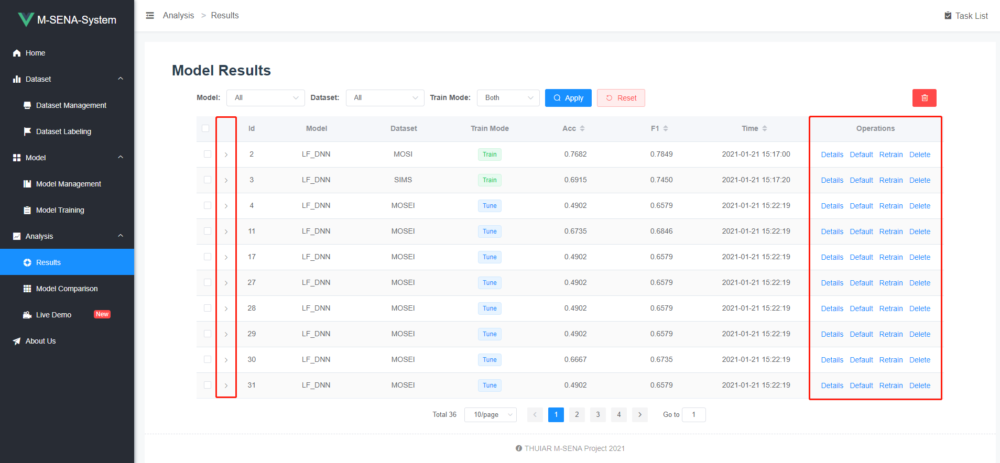
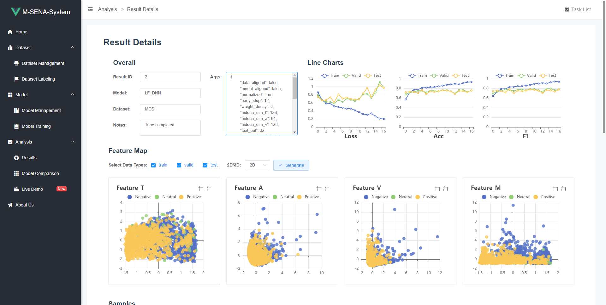
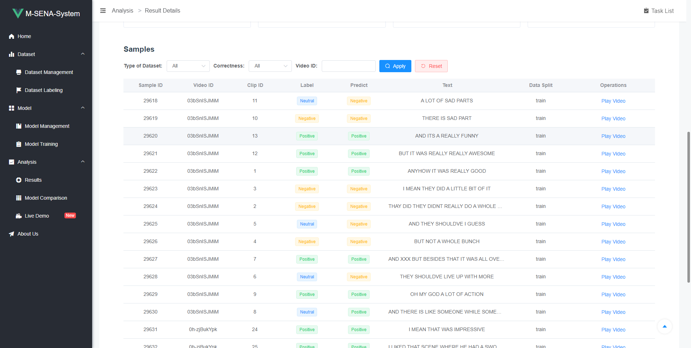
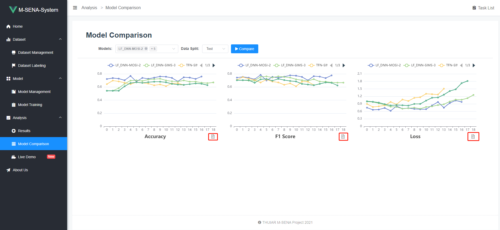
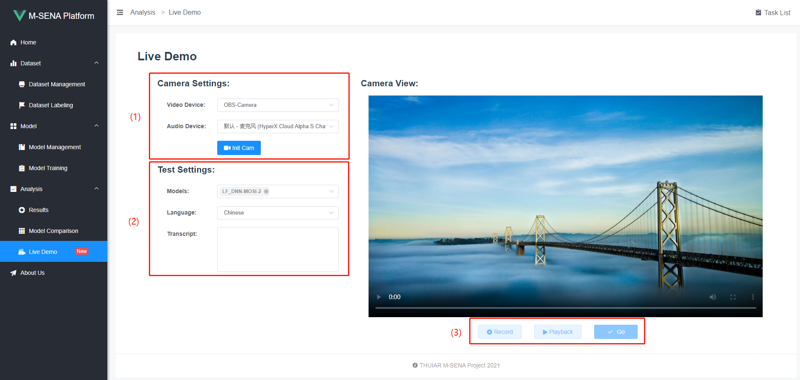
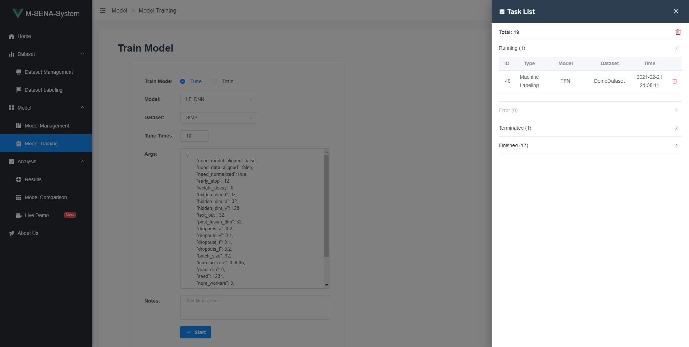

[](#License) [](https://github.com/FlameSky-S/M-SENA-frontend/releases) [](https://github.com/FlameSky-S/M-SENA-frontend/issues) [](https://thuiar.github.io/)

This project is the frontend of the [M-SENA Platform](https://github.com/thuiar/M-SENA/). It is developed base on [Vue.js](https://vuejs.org/) and [Element-ui](https://element.eleme.io/#/en-US).

- [Installation](#Installation)
  - [Docker](#Docker)
  - [Release Packages](#Release-Packages)
  - [Compile From Source](#Compile-From-Source)
  - [About Https](#About-HTTPS)
- [How to Use](#How-to-Use)
  - [Dataset](#Dataset)
    - [Dataset Management](#Dataset-Management)
    - [Dataset Details](#Dataset-Details)
    - [Dataset Labeling](#Dataset-Labeling)
  - [Model](#Model)
    - [Model Management](#Model-Management)
    - [Model Training](#Model-Training)
  - [Analysis](#Installation)
    - [Results](#Results)
    - [Result Details](#Result-Details)
    - [Model Comparison](#Model-Comparison)
    - [Live Demo](#Live-Demo)
  - [Task List](#Task-List)
- [License](#License)

# Installation

## Docker

We provide a [docker image](https://hub.docker.com/repository/docker/flamesky/m-sena-platform) in which both frontend and backend services are installed and configured. See the [main repo](https://github.com/thuiar/M-SENA#docker) for details.

## Release Packages

1. Go to the [release page](https://github.com/FlameSky-S/M-SENA-frontend/releases) and download the latest package. Unzip the files and put them under the directory of your web server. Here's an example config file with nginx:

```text
/etc/nginx/sites-available

   ... default configuration ...
   server {
      listen 80 default_server;
      root /home/thuiar/dist;    # directory of web files
      index.html;
      ... default configuration ...
   }

```

2. Open baseURL.js located under `static` folder and change the IP address to your backend server's IP.

```text
./static/baseURL.js

  window.baseURL = 'http://xx.xxx.xxx.xx:5000'
```

## Compile From Source

### Dependencies

1. node.js

```bash
$ apt install nodejs npm
```

### Build

Run the following commands to compile. The output files should be under `dist` folder. Just copy them to your web root directory and set it up like in [this section](#Release-Packages).

```shell
$ git clone https://github.com/FlameSky-S/M-SENA-frontend.git
$ cd M-SENA-frontend/frontend
$ npm i
$ npm run build
```

## About HTTPS

Some features (the [Live Demo](#Live-Demo) page) of the M-SENA Platform requires the page to be loaded in a secure context. A secure context is, in short, a page loaded using HTTPS or the `file:///` URL scheme, or a page loaded from localhost. If you find configuring HTTPS inconvenient, there are 3 possible workarounds for you:

1. Load the website from localhost. That means you have to deploy M-SENA-frontend and visit the website from the same machine.

2. Use port fowarding. Just foward the port of the web server (default 80, may differ when specified in config file) to your PC. For example: `serverIP:80 -> yourPC:8080`. Then you can visit `localhost:8080` on your PC.

3. Set Chrome flags. For those who use Chrome, visit `chrome://flags` and search for `Insecure origins treated as secure` option. Add your web server's IP, select "Enabled" on the right, and relaunch Chrome. Then you can visit M-SENA as if you have enabled HTTPS on it.

# How to Use

## Dataset

### Dataset Management

This page lists all the datasets available in the database along with some brief introduction.


1. Add/Rescan Dataset

The "Add/Update" button adds/updates a single dataset according to the given dataset name to the left. The "Rescan" button delete all existing datasets and re-add them along with new datasets. For detailed instructions on formatting and placing datasets, please refer to the [backend readme](https://github.com/iyuge2/M-SENA-Backend#datasets)

> Note: After updating one or more datasets, detailed sample data of previously trained results will be lost.

2. Operations for datasets

The "Details" button leads to a ["Dataset Details"](#Dataset-Details) page where more detailed information of the dataset will be given.

The "Lock/Unlock" button locks/unlocks the dataset. Locked datasets will not show up in the ["Dataset Labeling"](#Dataset-Labeling) page.

### Dataset Details

More information is given in this page, including data distribution charts, sample lists with filters and video players for each sample.


### Dataset Labeling

All the unlocked datsets are listed here. The "Label" button leads to a new page where all the labeling configurations and operations are given. The "Export" button exports all samples with their labels in the format of csv files.


After clicking the "Label" button, the new page looks like this:


The operation panel is on top right of the page. The classifier and selector used in auto labeling is selected and configured here. For more details about the auto labeling algorithm, please read [our paper]().

The labeling process should be a loop like this: "Auto --> Manual --> Auto", till all samples are labeled. After each round of auto labeling, a few samples requiring manual labeling will be sorted out by the algorithm and presented to the user.

After clicking the "Auto Label" button, the labeling task will start in background. The task is listed in the ["Task List"](#Task-List).

After clicking the "Manual" button, the page will look like this:


1. Click on the labels to add manual label to the given sample.

2. Use these buttons to navigate through the given sample list. Clikc "Submit" button to save all labels. You don't have to label all the samples in the list. However, the more samples you label, the higher the accuracy will be for the next round of auto labeling.

## Model

### Model Management

This page lists all the models available in the system. Feel free to add new models in the source code.


The "Results" button leads to ["Results"](#Results) page where trained results of the model is ilsted. The "Train" button leads to ["Model Training"](#Model-Training) page where you can train the model with specific parameters.

### Model Training

You can modify model parameters and start training tasks on this page.


The "Train Mode" has two options, "Tune" and "Train". The "Tune Mode" allows you to try different sets of parameter combinations. To do this, simply quote the parameters with square brackets. Here's an example:

```text
{
   ...
	"early_stop": [12,13,14,15,16],
	"batch_size": [32,64,128],
   ...
}
```

In this example, the system will search through 15 different sets of parameters, unless "Tune Times" is set to be lower than 15. If the "Tune times" is smaller than the number of parameter combinations, the system will randomly choose among the combinations.

The "Train Mode" works similar with "Tune Mode", but accepts just one set of parameter. However, the trained models will be saved for further analysis in ["Analysis"](#Analysis) section.

After clicking the "Start" button, the training task will be listed in the ["Task List"](#Task-List) to the right. Training results will be listed on ["Results"](#Results) page. Note that a "Tune" task will lead to multiple lines of results, according to the parameter combinations and value of "Tune Times".

## Analysis

### Results

All training results are listed here on this page. Use the filter and sorter on the top to find your desired result quickly.



For each result, double click or click the ">" arrow on the left to view a little more details. To view all the information stored for the chosen result, click the "Details" button on the right and jump to [Result Details](#Result-Details). The "Default" button sets the parameter of the result to be the default parameter of the model. The "Retrain" button leads to ["Model Training"](#Model-Training) page and fill in the parameters of the chosen result automatically. The "Delete" button deletes the chosen result.

### Result Details

This page shows all the details of a single training result, including line charts of 3 key metrics, feature representation map and all the samples with labels and predictions.



The feature representation map has a 2D and a 3D version. You can zoom, drag, rotate the charts with your mouse.



You can use the filter to quickly locate correctly/falsely predicted samples and watch the sample video to gain a better understanding of your model.

> Note: All samples of previous results will be lost here if you update or rescan datasets.

### Model Comparison

Models trained with "Train Mode" can be compared on this page. Charts as well as tables of 3 key metrics are given. Click the "file" icon to switch table/chart view.



### Live Demo

On this page, a live demo is presented to you with love from our team. You can record a short video of your own and use trained models to predict the sentiment. Hope you enjoy playing with it!



1. Select video and audio device. Click "Init Cam" button to turn on the selected devices.

> Note: You will get a blank device list if the browsing context is insecure (that is, the page is loaded using HTTP rather than HTTPS). See [About HTTPS](#About-Https) for possible solutions.

2. Select one or more models, the language you will speak in the video, and type in the sentences.

3. Click "Record" button and read your lines. After finishing recording, you can playback your video clip and re-record if not satisfied. Click "Go" to start analyzing. The results will be ready momentarily.

## Task List

The "Task List" button is on the top right corner. You can monitor task status here. Deleting tasks won't effect the results.



# License

M-SENA-frontend is published under the GNU GPL 3 license.
